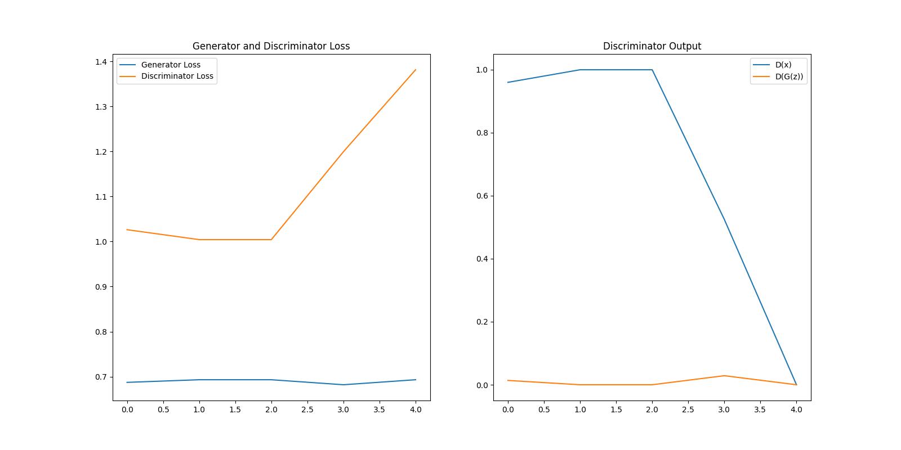
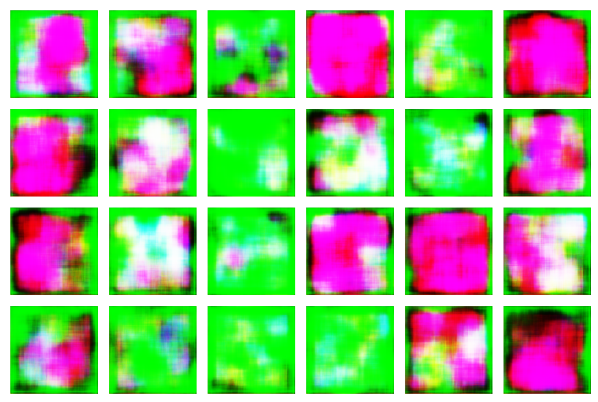

Job 124
=======


```
{
    "image_size": 128,
    "kernel_size": 3,
    "generator_lr": 0.0001,
    "discriminator_lr": 0.0004,
    "epochs": 30,
    "input_dir": "data/dataset-128-30000",
    "output_dir": "output/out-124",
    "checkpoint_freq": 30
}
```  
<p align="center">
    
</p>  
<p align="center">
    
</p>