Job 0
=====


```
{
    "image_size": 64,
    "kernel_size": 3,
    "generator_lr": 4e-05,
    "discriminator_lr": 4e-05,
    "epochs": 30,
    "input_dir": "data/dataset-64-30000",
    "output_dir": "output/out-0",
    "checkpoint_freq": 30
}
```  
<p align="center">
    
</p>  
<p align="center">
    
</p>
Job 1
=====


```
{
    "image_size": 64,
    "kernel_size": 3,
    "generator_lr": 6e-05,
    "discriminator_lr": 6e-05,
    "epochs": 30,
    "input_dir": "data/dataset-64-30000",
    "output_dir": "output/out-1",
    "checkpoint_freq": 30
}
```  
<p align="center">
    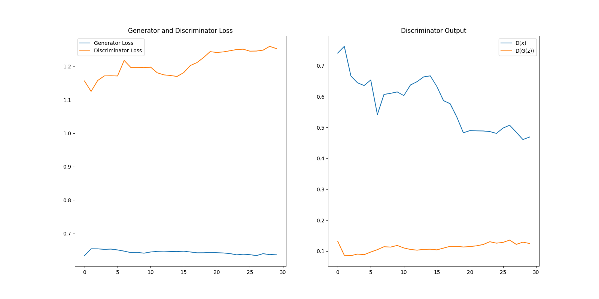
</p>  
<p align="center">
    
</p>
Job 2
=====


```
{
    "image_size": 64,
    "kernel_size": 3,
    "generator_lr": 8e-05,
    "discriminator_lr": 8e-05,
    "epochs": 30,
    "input_dir": "data/dataset-64-30000",
    "output_dir": "output/out-2",
    "checkpoint_freq": 30
}
```  
<p align="center">
    
</p>  
<p align="center">
    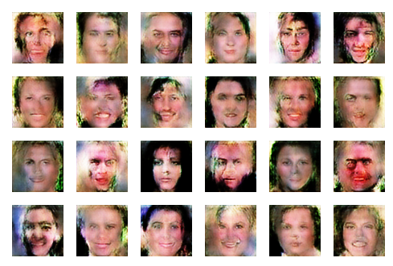
</p>
Job 3
=====


```
{
    "image_size": 64,
    "kernel_size": 3,
    "generator_lr": 0.0001,
    "discriminator_lr": 0.0001,
    "epochs": 30,
    "input_dir": "data/dataset-64-30000",
    "output_dir": "output/out-3",
    "checkpoint_freq": 30
}
```  
<p align="center">
    
</p>
Job 10
======


```
{
    "image_size": 64,
    "kernel_size": 3,
    "generator_lr": 6e-05,
    "discriminator_lr": 0.00012,
    "epochs": 30,
    "input_dir": "data/dataset-64-30000",
    "output_dir": "output/out-10",
    "checkpoint_freq": 30
}
```  
<p align="center">
    
</p>  
<p align="center">
    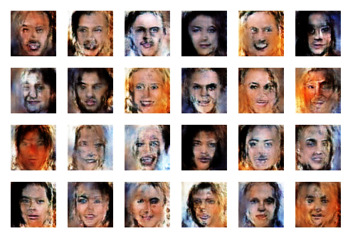
</p>
Job 11
======


```
{
    "image_size": 64,
    "kernel_size": 3,
    "generator_lr": 8e-05,
    "discriminator_lr": 0.00016,
    "epochs": 30,
    "input_dir": "data/dataset-64-30000",
    "output_dir": "output/out-11",
    "checkpoint_freq": 30
}
```  
<p align="center">
    
</p>  
<p align="center">
    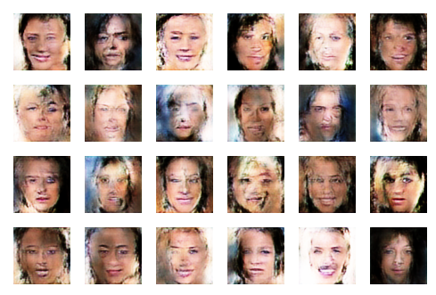
</p>
Job 12
======


```
{
    "image_size": 64,
    "kernel_size": 3,
    "generator_lr": 0.0001,
    "discriminator_lr": 0.0002,
    "epochs": 30,
    "input_dir": "data/dataset-64-30000",
    "output_dir": "output/out-12",
    "checkpoint_freq": 30
}
```  
<p align="center">
    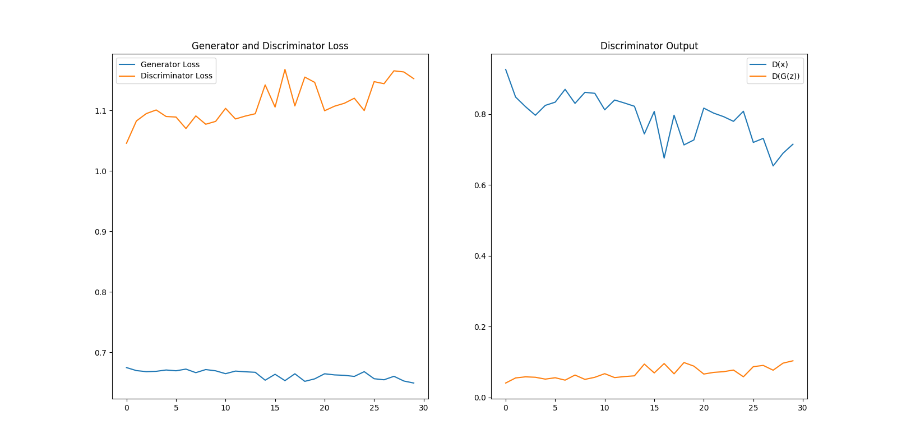
</p>  
<p align="center">
    
</p>
Job 13
======


```
{
    "image_size": 64,
    "kernel_size": 3,
    "generator_lr": 1.5e-05,
    "discriminator_lr": 3e-05,
    "epochs": 30,
    "input_dir": "data/dataset-64-30000",
    "output_dir": "output/out-13",
    "checkpoint_freq": 30
}
```  
<p align="center">
    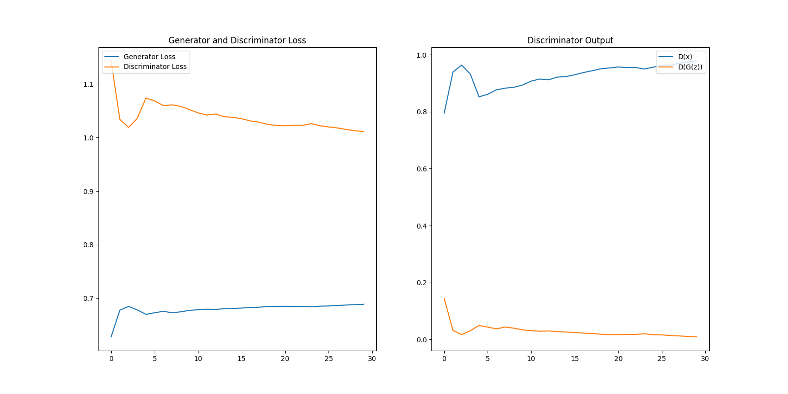
</p>  
<p align="center">
    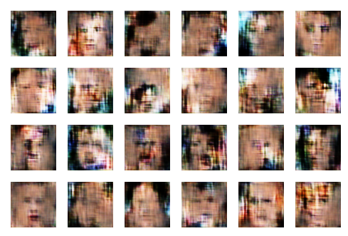
</p>
Job 14
======


```
{
    "image_size": 64,
    "kernel_size": 3,
    "generator_lr": 0.0002,
    "discriminator_lr": 0.0004,
    "epochs": 30,
    "input_dir": "data/dataset-64-30000",
    "output_dir": "output/out-14",
    "checkpoint_freq": 30
}
```  
<p align="center">
    
</p>  
<p align="center">
    
</p>
Job 15
======


```
{
    "image_size": 64,
    "kernel_size": 3,
    "generator_lr": 0.00025,
    "discriminator_lr": 0.0005,
    "epochs": 30,
    "input_dir": "data/dataset-64-30000",
    "output_dir": "output/out-15",
    "checkpoint_freq": 30
}
```  
<p align="center">
    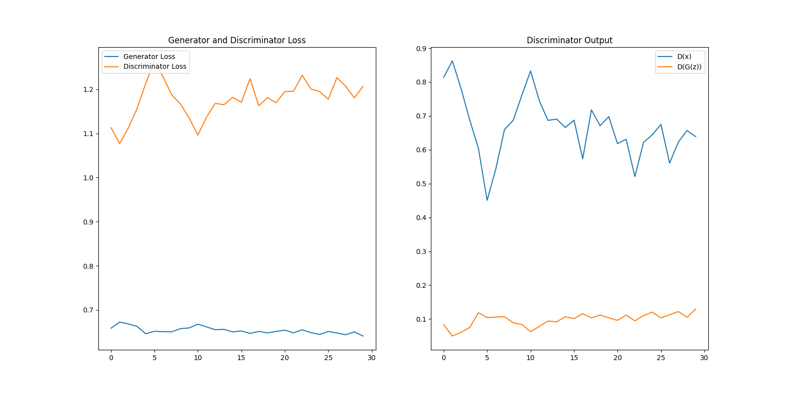
</p>  
<p align="center">
    
</p>
Job 16
======


```
{
    "image_size": 64,
    "kernel_size": 3,
    "generator_lr": 4e-05,
    "discriminator_lr": 5e-05,
    "epochs": 30,
    "input_dir": "data/dataset-64-30000",
    "output_dir": "output/out-16",
    "checkpoint_freq": 30
}
```  
<p align="center">
    
</p>  
<p align="center">
    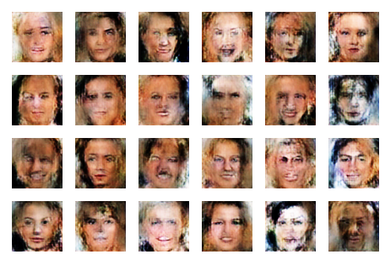
</p>
Job 17
======


```
{
    "image_size": 64,
    "kernel_size": 3,
    "generator_lr": 6e-05,
    "discriminator_lr": 7.500000000000001e-05,
    "epochs": 30,
    "input_dir": "data/dataset-64-30000",
    "output_dir": "output/out-17",
    "checkpoint_freq": 30
}
```  
<p align="center">
    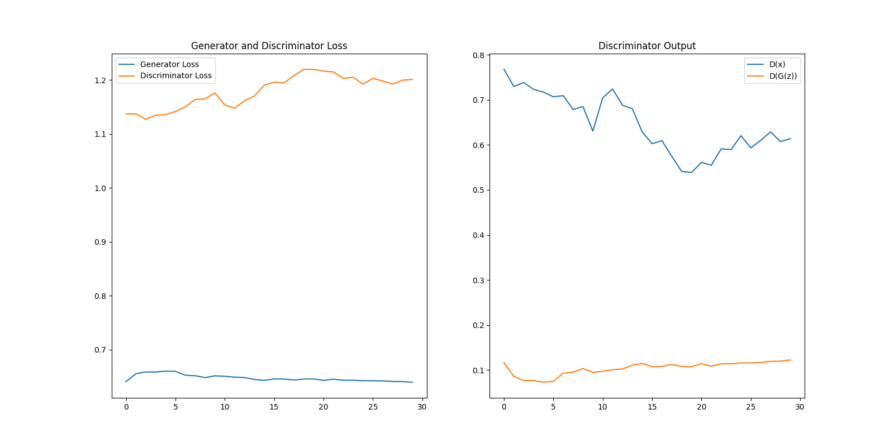
</p>  
<p align="center">
    
</p>
Job 18
======


```
{
    "image_size": 64,
    "kernel_size": 3,
    "generator_lr": 8e-05,
    "discriminator_lr": 0.0001,
    "epochs": 30,
    "input_dir": "data/dataset-64-30000",
    "output_dir": "output/out-18",
    "checkpoint_freq": 30
}
```  
<p align="center">
    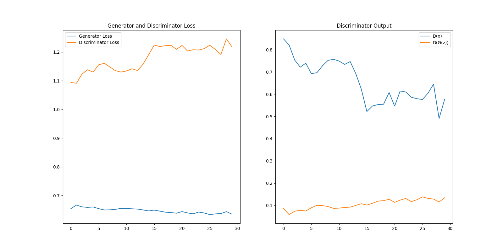
</p>  
<p align="center">
    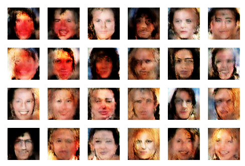
</p>
Job 19
======


```
{
    "image_size": 64,
    "kernel_size": 3,
    "generator_lr": 0.0001,
    "discriminator_lr": 0.000125,
    "epochs": 30,
    "input_dir": "data/dataset-64-30000",
    "output_dir": "output/out-19",
    "checkpoint_freq": 30
}
```  
<p align="center">
    
</p>  
<p align="center">
    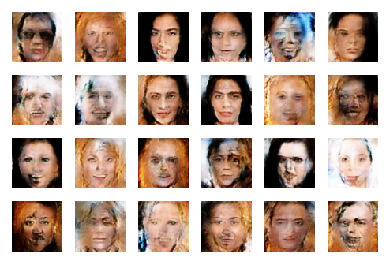
</p>
Job 20
======


```
{
    "image_size": 64,
    "kernel_size": 3,
    "generator_lr": 1.5e-05,
    "discriminator_lr": 1.8750000000000002e-05,
    "epochs": 30,
    "input_dir": "data/dataset-64-30000",
    "output_dir": "output/out-20",
    "checkpoint_freq": 30
}
```  
<p align="center">
    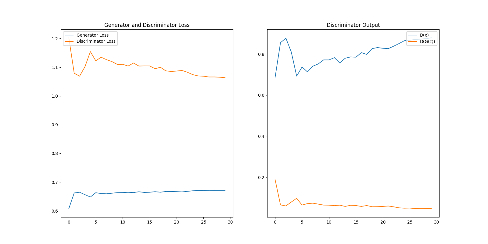
</p>  
<p align="center">
    
</p>
Job 21
======


```
{
    "image_size": 64,
    "kernel_size": 3,
    "generator_lr": 0.0002,
    "discriminator_lr": 0.00025,
    "epochs": 30,
    "input_dir": "data/dataset-64-30000",
    "output_dir": "output/out-21",
    "checkpoint_freq": 30
}
```  
<p align="center">
    
</p>  
<p align="center">
    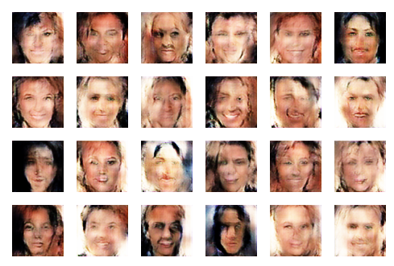
</p>
Job 22
======


```
{
    "image_size": 64,
    "kernel_size": 3,
    "generator_lr": 0.00025,
    "discriminator_lr": 0.0003125,
    "epochs": 30,
    "input_dir": "data/dataset-64-30000",
    "output_dir": "output/out-22",
    "checkpoint_freq": 30
}
```  
<p align="center">
    
</p>  
<p align="center">
    
</p>
Job 23
======


```
{
    "image_size": 64,
    "kernel_size": 3,
    "generator_lr": 0.00035,
    "discriminator_lr": 0.0004375,
    "epochs": 30,
    "input_dir": "data/dataset-64-30000",
    "output_dir": "output/out-23",
    "checkpoint_freq": 30
}
```  
<p align="center">
    
</p>  
<p align="center">
    
</p>
Job 24
======


```
{
    "image_size": 64,
    "kernel_size": 3,
    "generator_lr": 0.0004,
    "discriminator_lr": 0.0005,
    "epochs": 30,
    "input_dir": "data/dataset-64-30000",
    "output_dir": "output/out-24",
    "checkpoint_freq": 30
}
```  
<p align="center">
    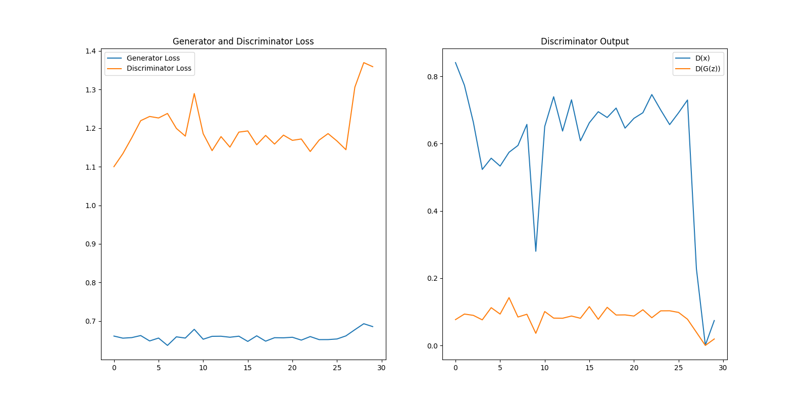
</p>  
<p align="center">
    
</p>
Job 25
======


```
{
    "image_size": 64,
    "kernel_size": 3,
    "generator_lr": 4e-05,
    "discriminator_lr": 6.000000000000001e-05,
    "epochs": 30,
    "input_dir": "data/dataset-64-30000",
    "output_dir": "output/out-25",
    "checkpoint_freq": 30
}
```  
<p align="center">
    
</p>  
<p align="center">
    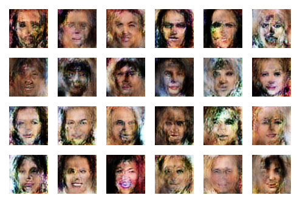
</p>
Job 26
======


```
{
    "image_size": 64,
    "kernel_size": 3,
    "generator_lr": 6e-05,
    "discriminator_lr": 9e-05,
    "epochs": 30,
    "input_dir": "data/dataset-64-30000",
    "output_dir": "output/out-26",
    "checkpoint_freq": 30
}
```  
<p align="center">
    
</p>  
<p align="center">
    
</p>
Job 27
======


```
{
    "image_size": 64,
    "kernel_size": 3,
    "generator_lr": 8e-05,
    "discriminator_lr": 0.00012000000000000002,
    "epochs": 30,
    "input_dir": "data/dataset-64-30000",
    "output_dir": "output/out-27",
    "checkpoint_freq": 30
}
```  
<p align="center">
    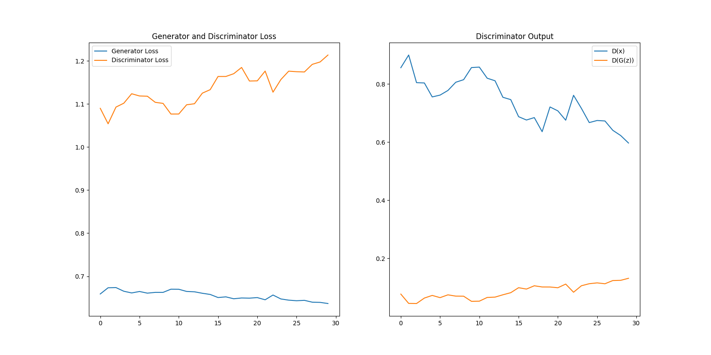
</p>  
<p align="center">
    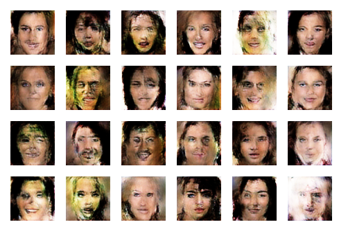
</p>
Job 28
======


```
{
    "image_size": 64,
    "kernel_size": 3,
    "generator_lr": 0.0001,
    "discriminator_lr": 0.00015000000000000001,
    "epochs": 30,
    "input_dir": "data/dataset-64-30000",
    "output_dir": "output/out-28",
    "checkpoint_freq": 30
}
```  
<p align="center">
    
</p>  
<p align="center">
    
</p>
Job 29
======


```
{
    "image_size": 64,
    "kernel_size": 3,
    "generator_lr": 1.5e-05,
    "discriminator_lr": 2.25e-05,
    "epochs": 30,
    "input_dir": "data/dataset-64-30000",
    "output_dir": "output/out-29",
    "checkpoint_freq": 30
}
```  
<p align="center">
    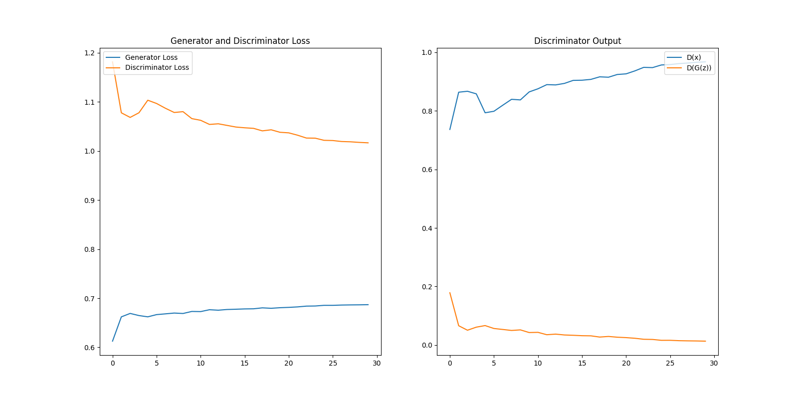
</p>  
<p align="center">
    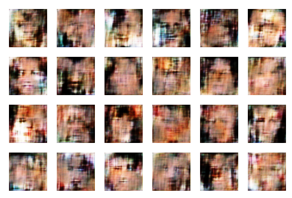
</p>
Job 30
======


```
{
    "image_size": 64,
    "kernel_size": 3,
    "generator_lr": 0.0002,
    "discriminator_lr": 0.00030000000000000003,
    "epochs": 30,
    "input_dir": "data/dataset-64-30000",
    "output_dir": "output/out-30",
    "checkpoint_freq": 30
}
```  
<p align="center">
    
</p>  
<p align="center">
    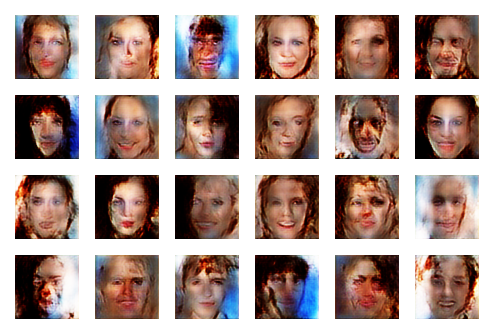
</p>
Job 31
======


```
{
    "image_size": 64,
    "kernel_size": 3,
    "generator_lr": 0.00025,
    "discriminator_lr": 0.000375,
    "epochs": 30,
    "input_dir": "data/dataset-64-30000",
    "output_dir": "output/out-31",
    "checkpoint_freq": 30
}
```  
<p align="center">
    
</p>  
<p align="center">
    
</p>
Job 32
======


```
{
    "image_size": 64,
    "kernel_size": 3,
    "generator_lr": 4e-05,
    "discriminator_lr": 0.00012000000000000002,
    "epochs": 30,
    "input_dir": "data/dataset-64-30000",
    "output_dir": "output/out-32",
    "checkpoint_freq": 30
}
```  
<p align="center">
    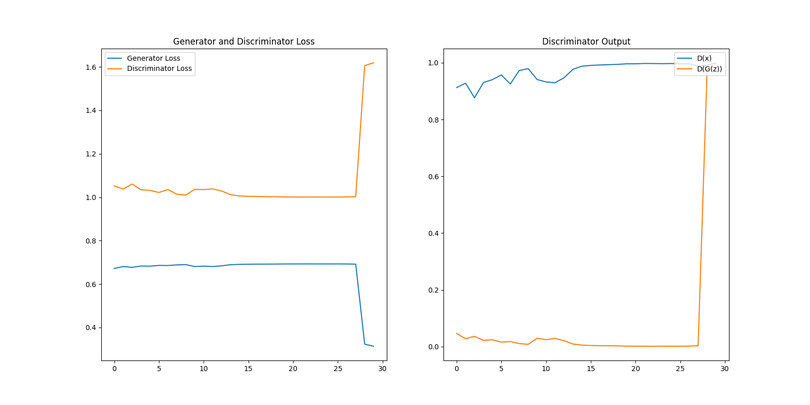
</p>  
<p align="center">
    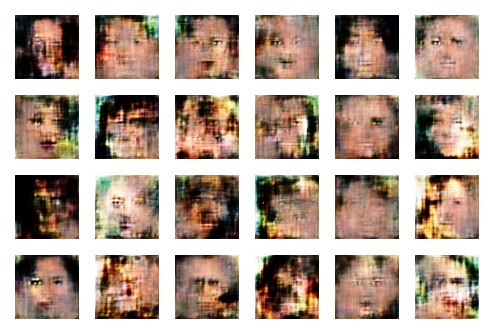
</p>
Job 33
======


```
{
    "image_size": 64,
    "kernel_size": 3,
    "generator_lr": 6e-05,
    "discriminator_lr": 0.00018,
    "epochs": 30,
    "input_dir": "data/dataset-64-30000",
    "output_dir": "output/out-33",
    "checkpoint_freq": 30
}
```  
<p align="center">
    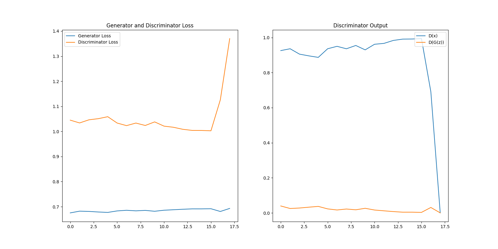
</p>  
<p align="center">
    
</p>
Job 34
======


```
{
    "image_size": 64,
    "kernel_size": 3,
    "generator_lr": 8e-05,
    "discriminator_lr": 0.00024000000000000003,
    "epochs": 30,
    "input_dir": "data/dataset-64-30000",
    "output_dir": "output/out-34",
    "checkpoint_freq": 30
}
```  
<p align="center">
    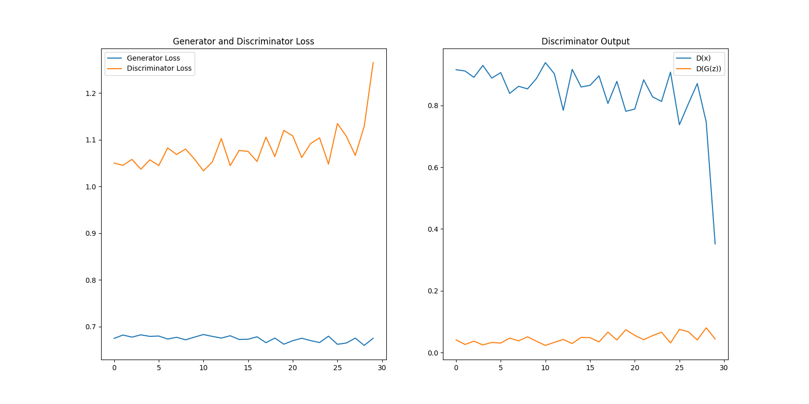
</p>  
<p align="center">
    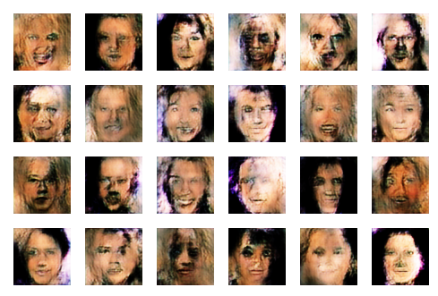
</p>
Job 35
======


```
{
    "image_size": 64,
    "kernel_size": 3,
    "generator_lr": 0.0001,
    "discriminator_lr": 0.00030000000000000003,
    "epochs": 30,
    "input_dir": "data/dataset-64-30000",
    "output_dir": "output/out-35",
    "checkpoint_freq": 30
}
```  
<p align="center">
    
</p>  
<p align="center">
    
</p>
Job 36
======


```
{
    "image_size": 64,
    "kernel_size": 3,
    "generator_lr": 1.5e-05,
    "discriminator_lr": 4.5e-05,
    "epochs": 30,
    "input_dir": "data/dataset-64-30000",
    "output_dir": "output/out-36",
    "checkpoint_freq": 30
}
```  
<p align="center">
    
</p>  
<p align="center">
    
</p>
Job 37
======


```
{
    "image_size": 64,
    "kernel_size": 3,
    "generator_lr": 4e-05,
    "discriminator_lr": 0.00016,
    "epochs": 30,
    "input_dir": "data/dataset-64-30000",
    "output_dir": "output/out-37",
    "checkpoint_freq": 30
}
```  
<p align="center">
    
</p>  
<p align="center">
    
</p>
Job 38
======


```
{
    "image_size": 64,
    "kernel_size": 3,
    "generator_lr": 6e-05,
    "discriminator_lr": 0.00024,
    "epochs": 30,
    "input_dir": "data/dataset-64-30000",
    "output_dir": "output/out-38",
    "checkpoint_freq": 30
}
```  
<p align="center">
    
</p>  
<p align="center">
    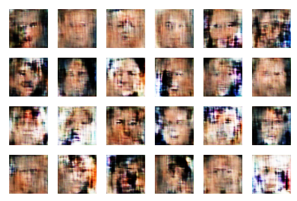
</p>
Job 39
======


```
{
    "image_size": 64,
    "kernel_size": 3,
    "generator_lr": 8e-05,
    "discriminator_lr": 0.00032,
    "epochs": 30,
    "input_dir": "data/dataset-64-30000",
    "output_dir": "output/out-39",
    "checkpoint_freq": 30
}
```  
<p align="center">
    
</p>
Job 40
======


```
{
    "image_size": 64,
    "kernel_size": 3,
    "generator_lr": 0.0001,
    "discriminator_lr": 0.0004,
    "epochs": 30,
    "input_dir": "data/dataset-64-30000",
    "output_dir": "output/out-40",
    "checkpoint_freq": 30
}
```  
<p align="center">
    
</p>
Job 41
======


```
{
    "image_size": 64,
    "kernel_size": 3,
    "generator_lr": 1.5e-05,
    "discriminator_lr": 6e-05,
    "epochs": 30,
    "input_dir": "data/dataset-64-30000",
    "output_dir": "output/out-41",
    "checkpoint_freq": 30
}
```  
<p align="center">
    
</p>
Job 42
======


```
{
    "image_size": 64,
    "kernel_size": 5,
    "generator_lr": 4e-05,
    "discriminator_lr": 4e-05,
    "epochs": 30,
    "input_dir": "data/dataset-64-30000",
    "output_dir": "output/out-42",
    "checkpoint_freq": 30
}
```  
<p align="center">
    
</p>
Job 43
======


```
{
    "image_size": 64,
    "kernel_size": 5,
    "generator_lr": 6e-05,
    "discriminator_lr": 6e-05,
    "epochs": 30,
    "input_dir": "data/dataset-64-30000",
    "output_dir": "output/out-43",
    "checkpoint_freq": 30
}
```  
<p align="center">
    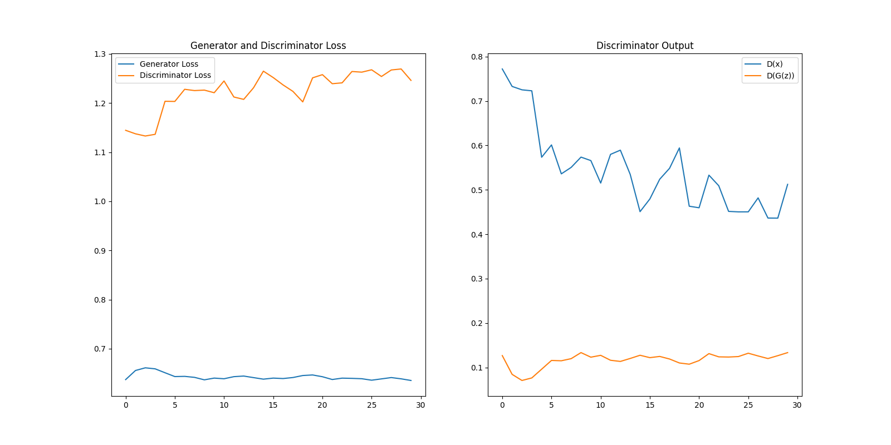
</p>  
<p align="center">
    
</p>
Job 44
======


```
{
    "image_size": 64,
    "kernel_size": 5,
    "generator_lr": 8e-05,
    "discriminator_lr": 8e-05,
    "epochs": 30,
    "input_dir": "data/dataset-64-30000",
    "output_dir": "output/out-44",
    "checkpoint_freq": 30
}
```  
<p align="center">
    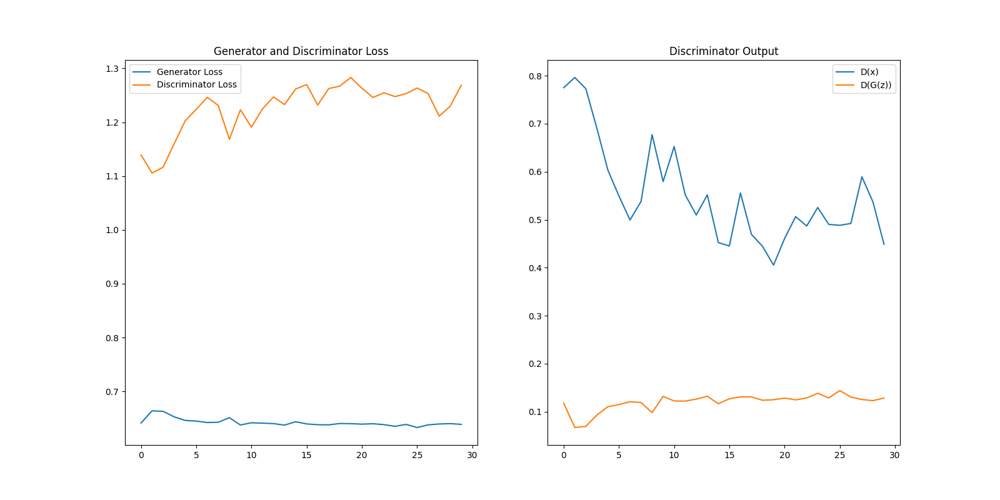
</p>  
<p align="center">
    
</p>
Job 45
======


```
{
    "image_size": 64,
    "kernel_size": 5,
    "generator_lr": 0.0001,
    "discriminator_lr": 0.0001,
    "epochs": 30,
    "input_dir": "data/dataset-64-30000",
    "output_dir": "output/out-45",
    "checkpoint_freq": 30
}
```  
<p align="center">
    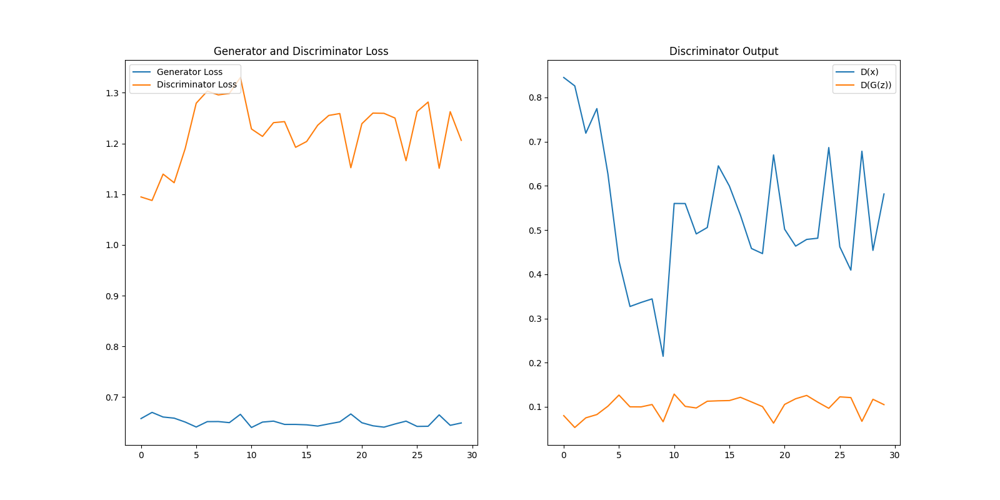
</p>  
<p align="center">
    
</p>
Job 46
======


```
{
    "image_size": 64,
    "kernel_size": 5,
    "generator_lr": 1.5e-05,
    "discriminator_lr": 1.5e-05,
    "epochs": 30,
    "input_dir": "data/dataset-64-30000",
    "output_dir": "output/out-46",
    "checkpoint_freq": 30
}
```
Job 100
=======


```
{
    "image_size": 128,
    "kernel_size": 3,
    "generator_lr": 4e-05,
    "discriminator_lr": 5e-05,
    "epochs": 30,
    "input_dir": "data/dataset-128-30000",
    "output_dir": "output/out-100",
    "checkpoint_freq": 30
}
```  
<p align="center">
    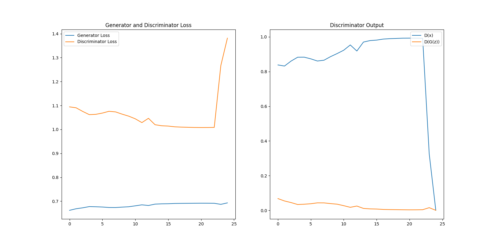
</p>  
<p align="center">
    
</p>
Job 101
=======


```
{
    "image_size": 128,
    "kernel_size": 3,
    "generator_lr": 6e-05,
    "discriminator_lr": 7.500000000000001e-05,
    "epochs": 30,
    "input_dir": "data/dataset-128-30000",
    "output_dir": "output/out-101",
    "checkpoint_freq": 30
}
```  
<p align="center">
    
</p>  
<p align="center">
    
</p>
Job 102
=======


```
{
    "image_size": 128,
    "kernel_size": 3,
    "generator_lr": 8e-05,
    "discriminator_lr": 0.0001,
    "epochs": 30,
    "input_dir": "data/dataset-128-30000",
    "output_dir": "output/out-102",
    "checkpoint_freq": 30
}
```  
<p align="center">
    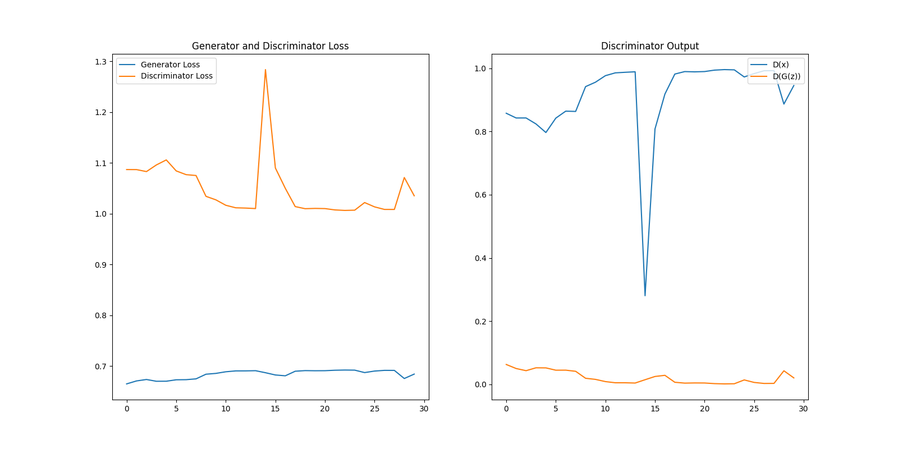
</p>  
<p align="center">
    
</p>
Job 103
=======


```
{
    "image_size": 128,
    "kernel_size": 3,
    "generator_lr": 0.0001,
    "discriminator_lr": 0.000125,
    "epochs": 30,
    "input_dir": "data/dataset-128-30000",
    "output_dir": "output/out-103",
    "checkpoint_freq": 30
}
```  
<p align="center">
    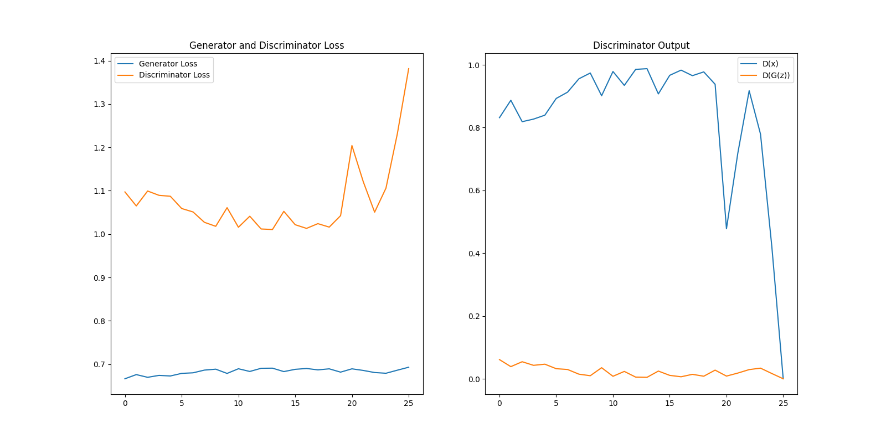
</p>  
<p align="center">
    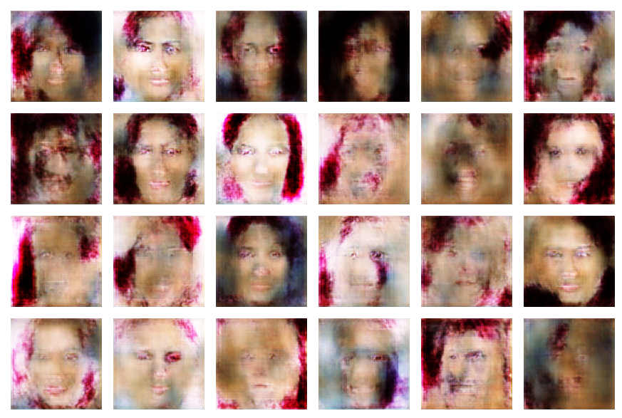
</p>
Job 104
=======


```
{
    "image_size": 128,
    "kernel_size": 3,
    "generator_lr": 1.5e-05,
    "discriminator_lr": 1.8750000000000002e-05,
    "epochs": 30,
    "input_dir": "data/dataset-128-30000",
    "output_dir": "output/out-104",
    "checkpoint_freq": 30
}
```  
<p align="center">
    
</p>  
<p align="center">
    
</p>
Job 105
=======


```
{
    "image_size": 128,
    "kernel_size": 3,
    "generator_lr": 0.0002,
    "discriminator_lr": 0.00025,
    "epochs": 30,
    "input_dir": "data/dataset-128-30000",
    "output_dir": "output/out-105",
    "checkpoint_freq": 30
}
```  
<p align="center">
    
</p>  
<p align="center">
    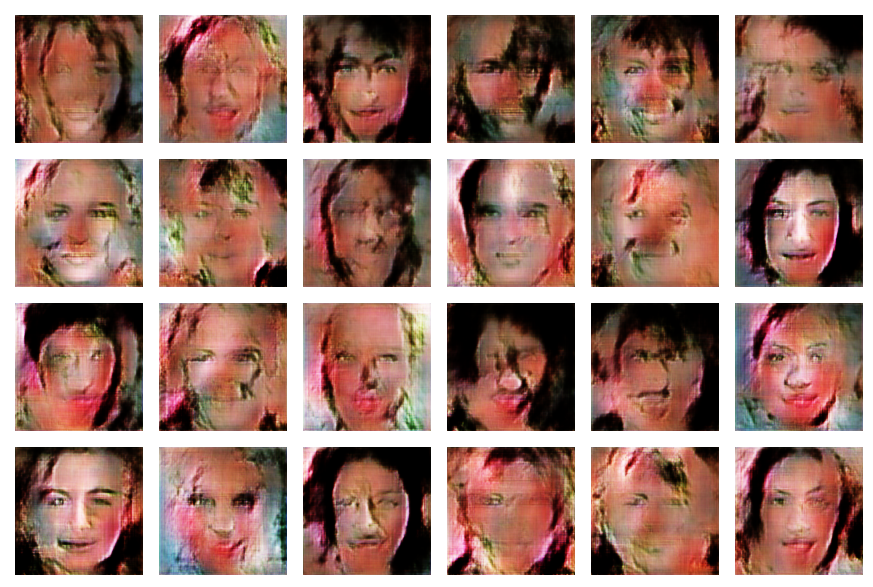
</p>
Job 106
=======


```
{
    "image_size": 128,
    "kernel_size": 3,
    "generator_lr": 0.00025,
    "discriminator_lr": 0.0003125,
    "epochs": 30,
    "input_dir": "data/dataset-128-30000",
    "output_dir": "output/out-106",
    "checkpoint_freq": 30
}
```  
<p align="center">
    
</p>  
<p align="center">
    
</p>
Job 107
=======


```
{
    "image_size": 128,
    "kernel_size": 3,
    "generator_lr": 0.00035,
    "discriminator_lr": 0.0004375,
    "epochs": 30,
    "input_dir": "data/dataset-128-30000",
    "output_dir": "output/out-107",
    "checkpoint_freq": 30
}
```  
<p align="center">
    
</p>  
<p align="center">
    
</p>
Job 108
=======


```
{
    "image_size": 128,
    "kernel_size": 3,
    "generator_lr": 0.0004,
    "discriminator_lr": 0.0005,
    "epochs": 30,
    "input_dir": "data/dataset-128-30000",
    "output_dir": "output/out-108",
    "checkpoint_freq": 30
}
```  
<p align="center">
    
</p>  
<p align="center">
    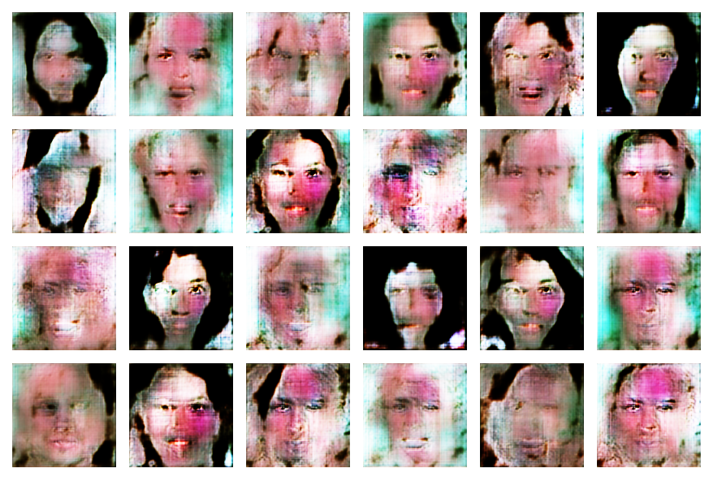
</p>
Job 109
=======


```
{
    "image_size": 128,
    "kernel_size": 3,
    "generator_lr": 4e-05,
    "discriminator_lr": 6.000000000000001e-05,
    "epochs": 30,
    "input_dir": "data/dataset-128-30000",
    "output_dir": "output/out-109",
    "checkpoint_freq": 30
}
```  
<p align="center">
    
</p>  
<p align="center">
    
</p>
Job 110
=======


```
{
    "image_size": 128,
    "kernel_size": 3,
    "generator_lr": 6e-05,
    "discriminator_lr": 9e-05,
    "epochs": 30,
    "input_dir": "data/dataset-128-30000",
    "output_dir": "output/out-110",
    "checkpoint_freq": 30
}
```  
<p align="center">
    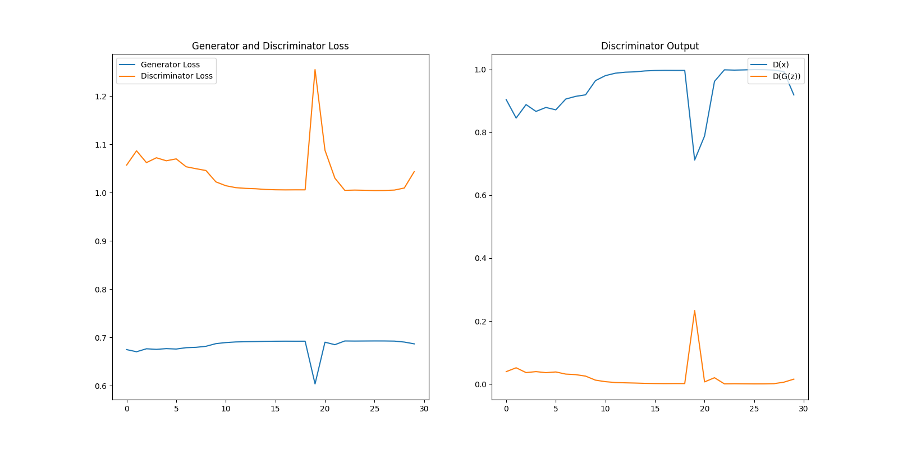
</p>  
<p align="center">
    
</p>
Job 111
=======


```
{
    "image_size": 128,
    "kernel_size": 3,
    "generator_lr": 8e-05,
    "discriminator_lr": 0.00012000000000000002,
    "epochs": 30,
    "input_dir": "data/dataset-128-30000",
    "output_dir": "output/out-111",
    "checkpoint_freq": 30
}
```  
<p align="center">
    
</p>  
<p align="center">
    
</p>
Job 112
=======


```
{
    "image_size": 128,
    "kernel_size": 3,
    "generator_lr": 0.0001,
    "discriminator_lr": 0.00015000000000000001,
    "epochs": 30,
    "input_dir": "data/dataset-128-30000",
    "output_dir": "output/out-112",
    "checkpoint_freq": 30
}
```  
<p align="center">
    
</p>  
<p align="center">
    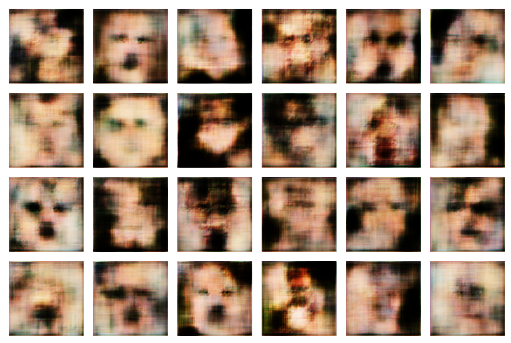
</p>
Job 113
=======


```
{
    "image_size": 128,
    "kernel_size": 3,
    "generator_lr": 1.5e-05,
    "discriminator_lr": 2.25e-05,
    "epochs": 30,
    "input_dir": "data/dataset-128-30000",
    "output_dir": "output/out-113",
    "checkpoint_freq": 30
}
```  
<p align="center">
    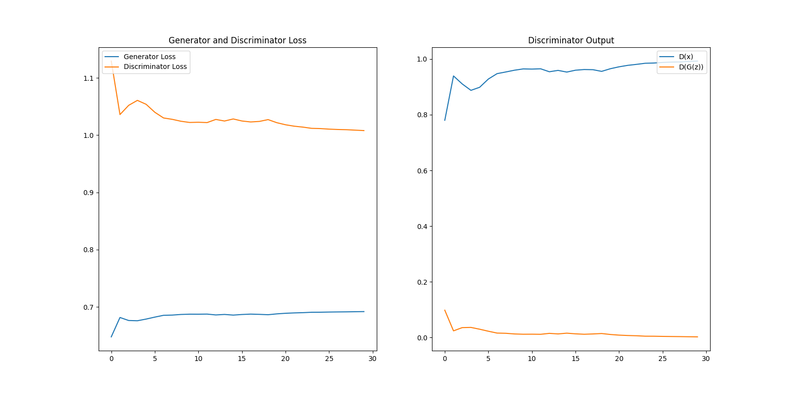
</p>  
<p align="center">
    
</p>
Job 114
=======


```
{
    "image_size": 128,
    "kernel_size": 3,
    "generator_lr": 0.0002,
    "discriminator_lr": 0.00030000000000000003,
    "epochs": 30,
    "input_dir": "data/dataset-128-30000",
    "output_dir": "output/out-114",
    "checkpoint_freq": 30
}
```  
<p align="center">
    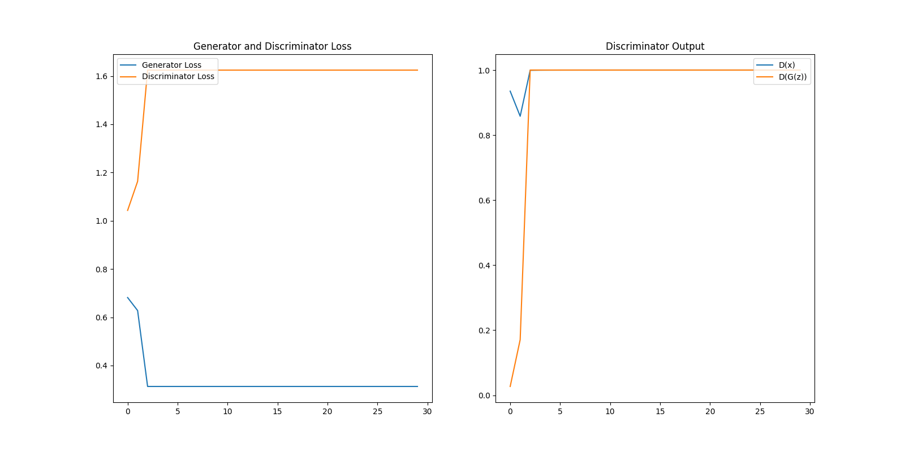
</p>  
<p align="center">
    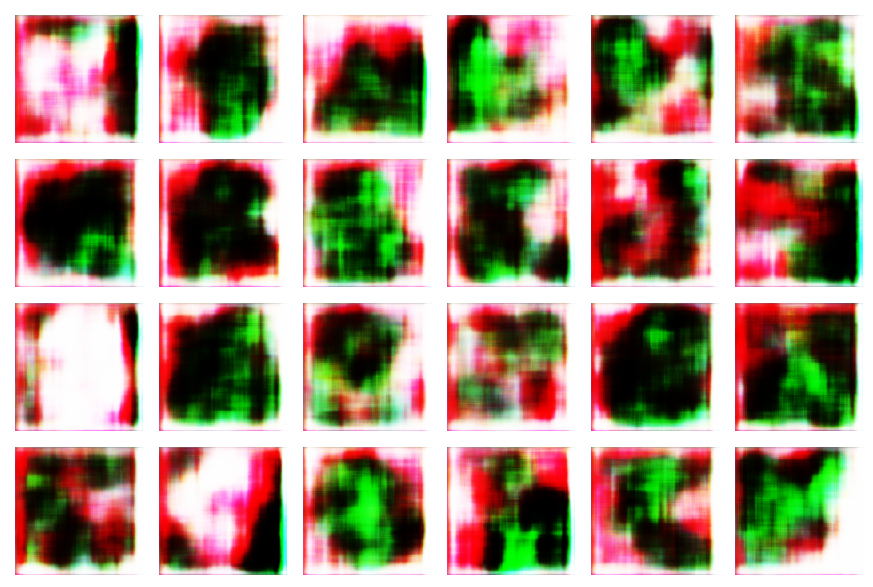
</p>
Job 115
=======


```
{
    "image_size": 128,
    "kernel_size": 3,
    "generator_lr": 0.00025,
    "discriminator_lr": 0.000375,
    "epochs": 30,
    "input_dir": "data/dataset-128-30000",
    "output_dir": "output/out-115",
    "checkpoint_freq": 30
}
```  
<p align="center">
    
</p>  
<p align="center">
    
</p>
Job 116
=======


```
{
    "image_size": 128,
    "kernel_size": 3,
    "generator_lr": 4e-05,
    "discriminator_lr": 0.00012000000000000002,
    "epochs": 30,
    "input_dir": "data/dataset-128-30000",
    "output_dir": "output/out-116",
    "checkpoint_freq": 30
}
```  
<p align="center">
    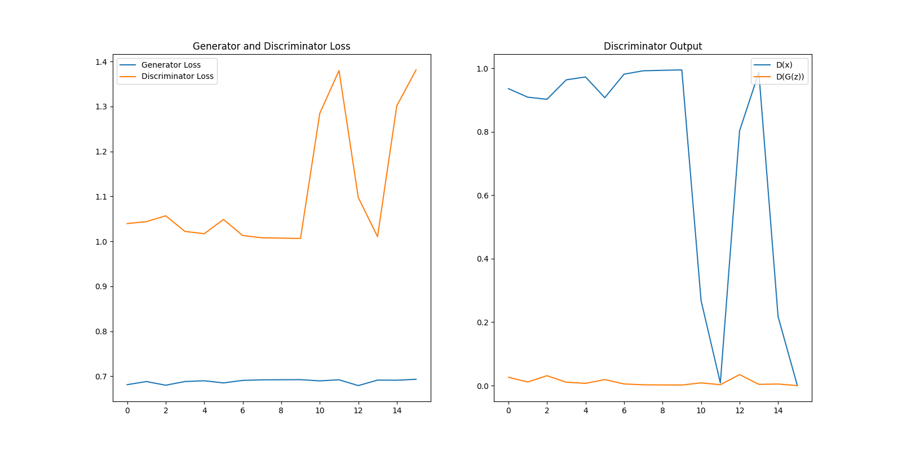
</p>  
<p align="center">
    
</p>
Job 117
=======


```
{
    "image_size": 128,
    "kernel_size": 3,
    "generator_lr": 6e-05,
    "discriminator_lr": 0.00018,
    "epochs": 30,
    "input_dir": "data/dataset-128-30000",
    "output_dir": "output/out-117",
    "checkpoint_freq": 30
}
```  
<p align="center">
    
</p>  
<p align="center">
    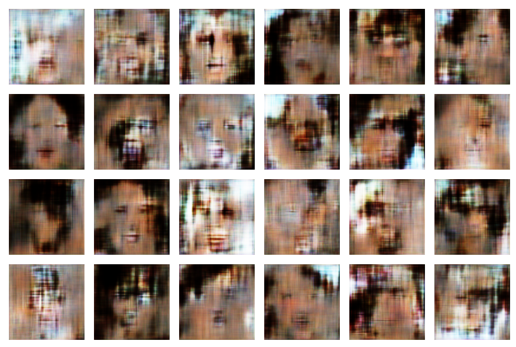
</p>
Job 118
=======


```
{
    "image_size": 128,
    "kernel_size": 3,
    "generator_lr": 8e-05,
    "discriminator_lr": 0.00024000000000000003,
    "epochs": 30,
    "input_dir": "data/dataset-128-30000",
    "output_dir": "output/out-118",
    "checkpoint_freq": 30
}
```  
<p align="center">
    
</p>  
<p align="center">
    
</p>
Job 119
=======


```
{
    "image_size": 128,
    "kernel_size": 3,
    "generator_lr": 0.0001,
    "discriminator_lr": 0.00030000000000000003,
    "epochs": 30,
    "input_dir": "data/dataset-128-30000",
    "output_dir": "output/out-119",
    "checkpoint_freq": 30
}
```  
<p align="center">
    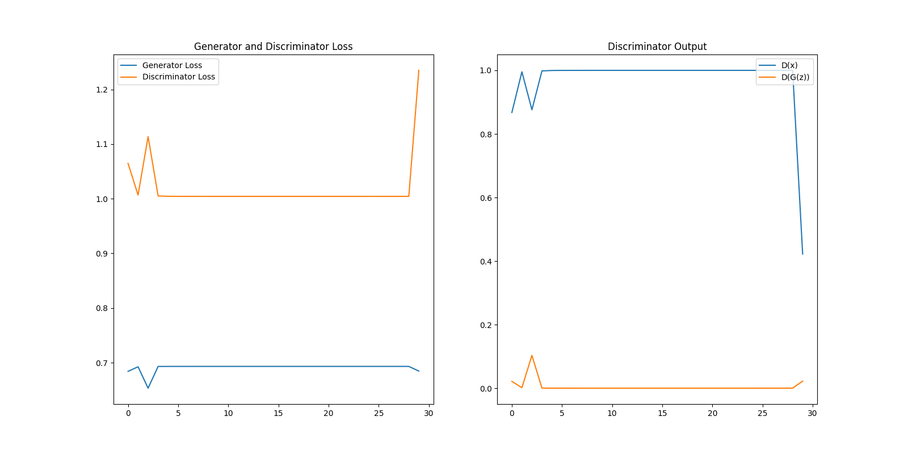
</p>  
<p align="center">
    
</p>
Job 120
=======


```
{
    "image_size": 128,
    "kernel_size": 3,
    "generator_lr": 1.5e-05,
    "discriminator_lr": 4.5e-05,
    "epochs": 30,
    "input_dir": "data/dataset-128-30000",
    "output_dir": "output/out-120",
    "checkpoint_freq": 30
}
```  
<p align="center">
    
</p>  
<p align="center">
    
</p>
Job 121
=======


```
{
    "image_size": 128,
    "kernel_size": 3,
    "generator_lr": 4e-05,
    "discriminator_lr": 0.00016,
    "epochs": 30,
    "input_dir": "data/dataset-128-30000",
    "output_dir": "output/out-121",
    "checkpoint_freq": 30
}
```  
<p align="center">
    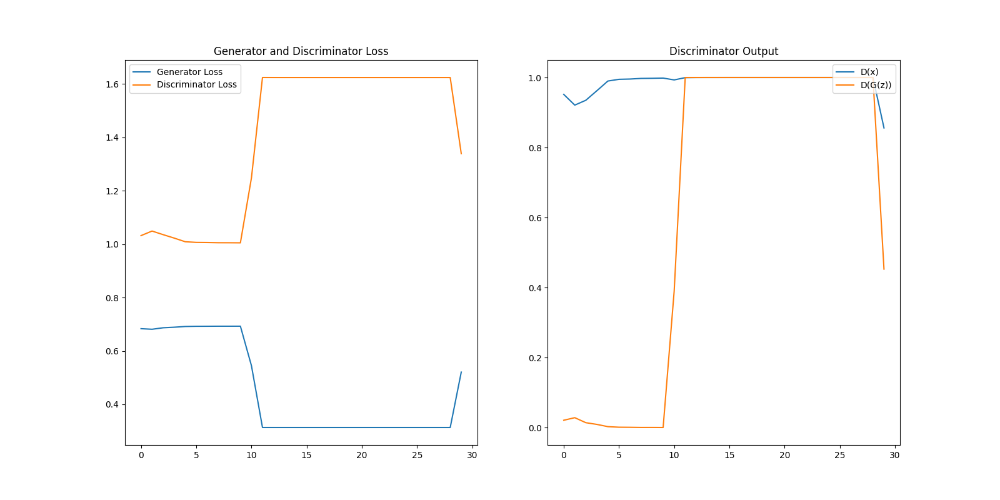
</p>  
<p align="center">
    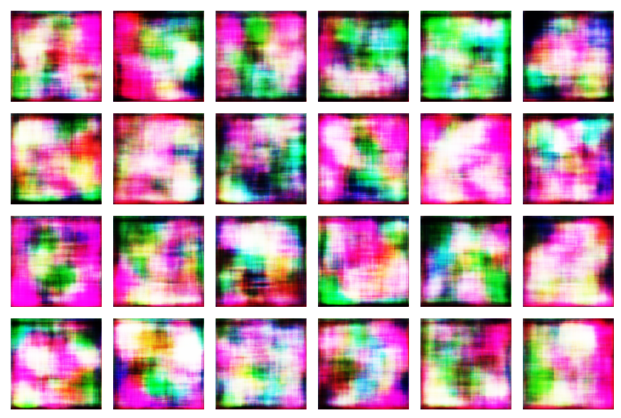
</p>
Job 122
=======


```
{
    "image_size": 128,
    "kernel_size": 3,
    "generator_lr": 6e-05,
    "discriminator_lr": 0.00024,
    "epochs": 30,
    "input_dir": "data/dataset-128-30000",
    "output_dir": "output/out-122",
    "checkpoint_freq": 30
}
```  
<p align="center">
    
</p>  
<p align="center">
    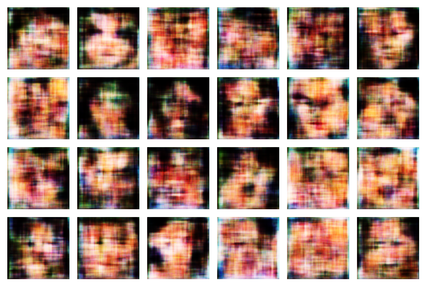
</p>
Job 123
=======


```
{
    "image_size": 128,
    "kernel_size": 3,
    "generator_lr": 8e-05,
    "discriminator_lr": 0.00032,
    "epochs": 30,
    "input_dir": "data/dataset-128-30000",
    "output_dir": "output/out-123",
    "checkpoint_freq": 30
}
```  
<p align="center">
    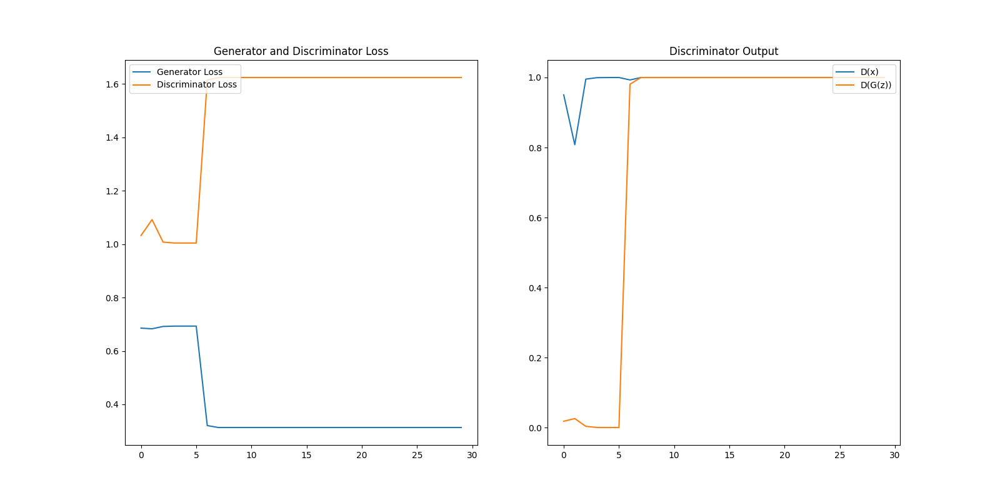
</p>  
<p align="center">
    
</p>
Job 124
=======


```
{
    "image_size": 128,
    "kernel_size": 3,
    "generator_lr": 0.0001,
    "discriminator_lr": 0.0004,
    "epochs": 30,
    "input_dir": "data/dataset-128-30000",
    "output_dir": "output/out-124",
    "checkpoint_freq": 30
}
```  
<p align="center">
    
</p>  
<p align="center">
    
</p>
Job 125
=======


```
{
    "image_size": 128,
    "kernel_size": 3,
    "generator_lr": 1.5e-05,
    "discriminator_lr": 6e-05,
    "epochs": 30,
    "input_dir": "data/dataset-128-30000",
    "output_dir": "output/out-125",
    "checkpoint_freq": 30
}
```  
<p align="center">
    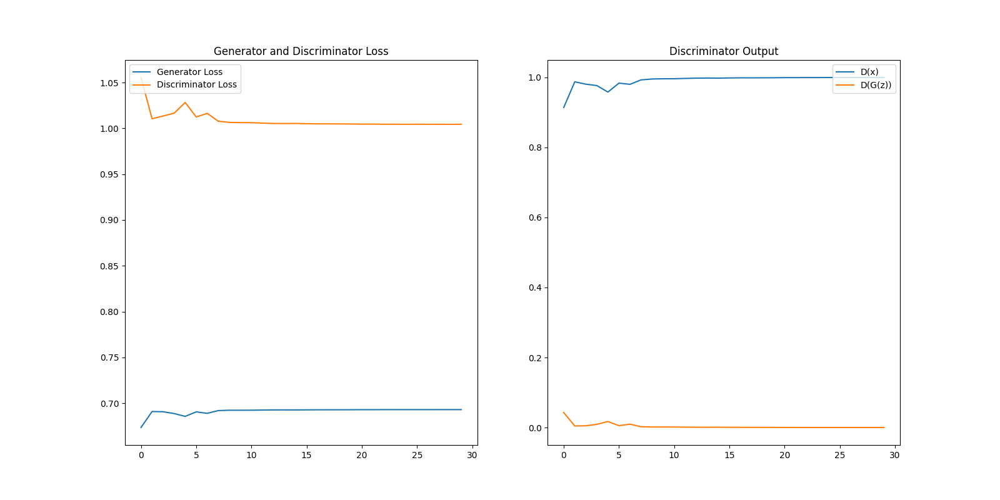
</p>  
<p align="center">
    
</p>
Job 126
=======


```
{
    "image_size": 128,
    "kernel_size": 5,
    "generator_lr": 4e-05,
    "discriminator_lr": 4e-05,
    "epochs": 30,
    "input_dir": "data/dataset-128-30000",
    "output_dir": "output/out-126",
    "checkpoint_freq": 30
}
```  
<p align="center">
    
</p>  
<p align="center">
    
</p>
Job 127
=======


```
{
    "image_size": 128,
    "kernel_size": 5,
    "generator_lr": 6e-05,
    "discriminator_lr": 6e-05,
    "epochs": 30,
    "input_dir": "data/dataset-128-30000",
    "output_dir": "output/out-127",
    "checkpoint_freq": 30
}
```  
<p align="center">
    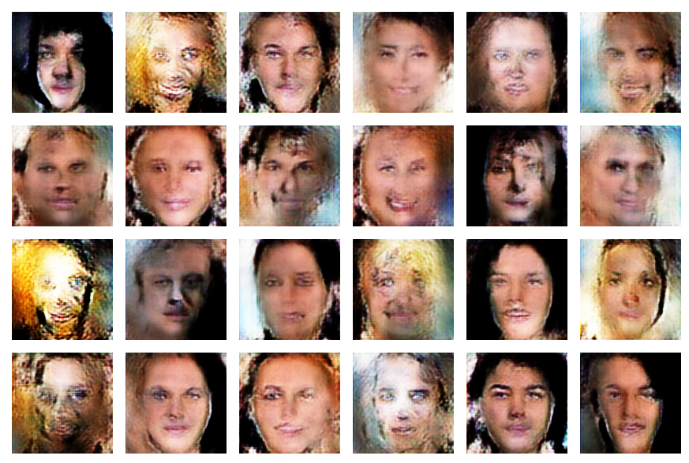
</p>
Job 128
=======


```
{
    "image_size": 128,
    "kernel_size": 5,
    "generator_lr": 8e-05,
    "discriminator_lr": 8e-05,
    "epochs": 30,
    "input_dir": "data/dataset-128-30000",
    "output_dir": "output/out-128",
    "checkpoint_freq": 30
}
```  
<p align="center">
    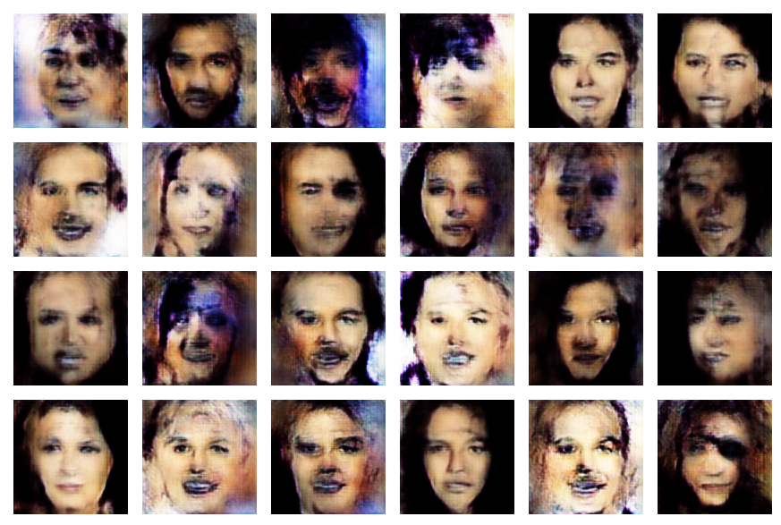
</p>
Job 129
=======


```
{
    "image_size": 128,
    "kernel_size": 5,
    "generator_lr": 0.0001,
    "discriminator_lr": 0.0001,
    "epochs": 30,
    "input_dir": "data/dataset-128-30000",
    "output_dir": "output/out-129",
    "checkpoint_freq": 30
}
```  
<p align="center">
    
</p>
Job 130
=======


```
{
    "image_size": 128,
    "kernel_size": 5,
    "generator_lr": 1.5e-05,
    "discriminator_lr": 1.5e-05,
    "epochs": 30,
    "input_dir": "data/dataset-128-30000",
    "output_dir": "output/out-130",
    "checkpoint_freq": 30
}
```  
<p align="center">
    
</p>
Job 131
=======


```
{
    "image_size": 128,
    "kernel_size": 5,
    "generator_lr": 0.0002,
    "discriminator_lr": 0.0002,
    "epochs": 30,
    "input_dir": "data/dataset-128-30000",
    "output_dir": "output/out-131",
    "checkpoint_freq": 30
}
```  
<p align="center">
    
</p>  
<p align="center">
    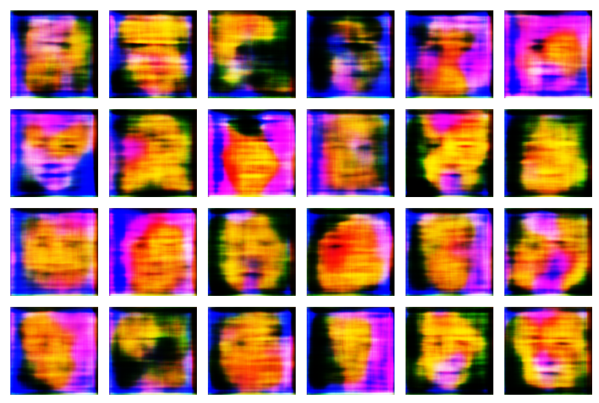
</p>
Job 132
=======


```
{
    "image_size": 128,
    "kernel_size": 5,
    "generator_lr": 0.00025,
    "discriminator_lr": 0.00025,
    "epochs": 30,
    "input_dir": "data/dataset-128-30000",
    "output_dir": "output/out-132",
    "checkpoint_freq": 30
}
```  
<p align="center">
    
</p>  
<p align="center">
    
</p>
Job 133
=======


```
{
    "image_size": 128,
    "kernel_size": 5,
    "generator_lr": 0.00035,
    "discriminator_lr": 0.00035,
    "epochs": 30,
    "input_dir": "data/dataset-128-30000",
    "output_dir": "output/out-133",
    "checkpoint_freq": 30
}
```  
<p align="center">
    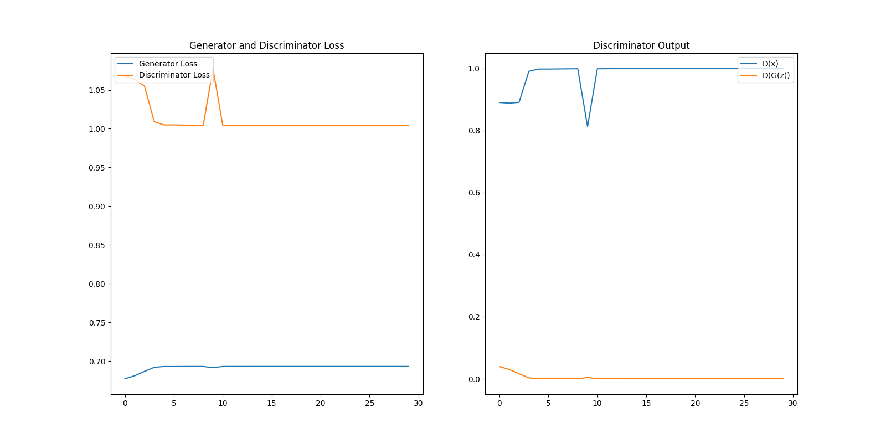
</p>  
<p align="center">
    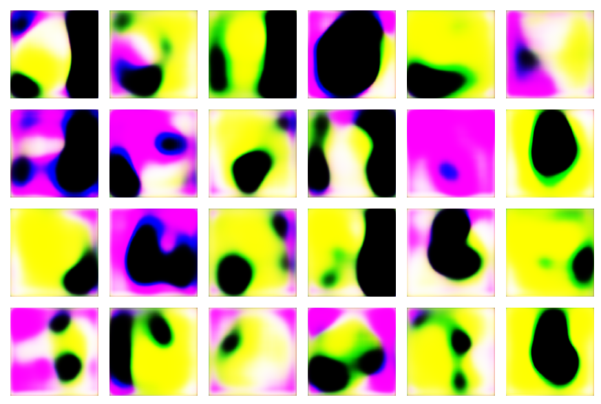
</p>
Job 134
=======


```
{
    "image_size": 128,
    "kernel_size": 5,
    "generator_lr": 0.0004,
    "discriminator_lr": 0.0004,
    "epochs": 30,
    "input_dir": "data/dataset-128-30000",
    "output_dir": "output/out-134",
    "checkpoint_freq": 30
}
```